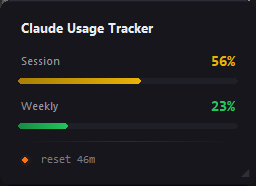

# Claude Usage Tracker

[](https://github.com/Liwindo/ClaudeUsageTracker/actions/workflows/ci.yml)
[](../../releases/latest)
[](../../releases)
[](LICENSE)


<p align="center">
  
</p>

A lightweight Windows system-tray tool that shows your [claude.ai](https://claude.ai) usage limits at a glance — a colour-coded tray icon and an optional floating widget, updated automatically in the background, so you never have to interrupt a conversation to check the usage page.

> **Disclaimer:** This tool uses internal, undocumented claude.ai API endpoints. It may break without notice. This project is not affiliated with or endorsed by Anthropic.

## Quick start

**Option A — Download the EXE (no Python required)**

1. Download `ClaudeUsageTracker.exe` from the [latest release](../../releases/latest)
2. Double-click it — it starts in the system tray

**Option B — Build from source**

Install [uv](https://docs.astral.sh/uv/), clone the repo, and run `build_exe.bat`. The script handles everything; the EXE ends up in `dist\ClaudeUsageTracker.exe`.

## How it works

The tool reads your existing claude.ai session cookies directly from Firefox's cookie database — read-only, no file copy, **no passwords, no manual exports, no stored credentials** — and polls claude.ai's internal `/usage` endpoint every 30 seconds (configurable). Firefox does not need to be open while the tool is running.

Once per app start it also asks the GitHub API whether a newer release exists; if so, a dialog offers to open the release page, skip that release permanently, or cancel (ask again next start). Disable with `update_check = false`. Only one instance can run at a time — starting the EXE again just shows a hint.

**Why Firefox only?** Since Chrome 127, Chromium browsers encrypt cookies with App-Bound Encryption — only the browser itself can decrypt them, and there is no user-space workaround. Firefox stores cookies unencrypted in SQLite, making it the only reliably supported browser.

## Requirements

- Windows 10/11
- **Firefox** (Mozilla build), logged in to claude.ai. Forks such as LibreWolf, Floorp, or Waterfox use different `AppData` paths and are not auto-detected — point `firefox_profile_path` at the fork's profile if you want to try them.
- Python 3.11+ and [uv](https://docs.astral.sh/uv/) *(only if building from source)*

## Tray icon & widget

The tray circle reflects your current **session (5-hour)** limit; the widget's progress bars use the same scale:

| Colour | Session usage |
|--------|--------------|
| 🟢 Green  | Below 40%   |
| 🟡 Yellow | 40–59%      |
| 🟠 Orange | 60–84%      |
| 🔴 Red    | 85%+        |
| ⚫ Grey   | No data / error |

Left-click the tray icon to show or hide the widget; right-click for **Refresh now**, **View log file**, **Open app data folder**, and **Quit**.

The always-on-top widget shows **session %**, **weekly %**, and a **reset countdown** whose dot colour indicates how soon the session limit refreshes (🟢 < 15 min · 🟡 15–30 · 🟠 30–90 · 🔴 > 90). Hover to reveal refresh / minimise / quit buttons, drag anywhere to move, resize via the bottom-right grip — position, size, and minimised state are remembered between sessions. When a poll fails, the footer shows a short message (e.g. *"Session expired — open claude.ai in Firefox"*); hovering over it reveals the full error and the log file path.

## Configuration

The config file is created automatically on first run at:

```
%APPDATA%\claude-usage-monitor\config.toml
```

It always contains **every** available option with its default value. When an update introduces a new option, it is appended to your existing file automatically on the next start — you only ever change values, never add keys.

```toml
# How often to poll claude.ai (seconds). Default: 30.
poll_interval_seconds = 30

# Percent thresholds that trigger a desktop notification.
notification_thresholds = [80, 95]

# Log level: DEBUG, INFO, WARNING, ERROR.
# Note: at DEBUG level the full claude.ai /usage response (including
# organisation UUID and bucket data) is written to app.log. Keep WARNING
# unless you're actively debugging, and review the log before sharing it.
log_level = "WARNING"

# Override the Firefox profile directory (leave empty for auto-detection), e.g.
# "C:\\Users\\You\\AppData\\Roaming\\Mozilla\\Firefox\\Profiles\\abc.default-release"
firefox_profile_path = ""

# Override the User-Agent sent to claude.ai (leave empty for the built-in
# default). Set this to your installed Firefox's User-Agent if Cloudflare
# starts blocking requests after a browser update — find yours at
# about:support → "User Agent".
user_agent = ""

# Check GitHub once per app start for a newer release. If one is found, a
# dialog offers to open the release page (or cancel). Set to false to
# disable the check entirely — no request is made to GitHub then.
update_check = true

# Set automatically by the update dialog's "Skip version" button; that
# release is never offered again. Clear it to re-enable the dialog.
skip_update_version = ""

# Start with Windows (current user). Only effective for the packaged EXE;
# the registry entry is kept in sync with this value on every start.
autostart = false
```

## Development

```bash
uv sync --extra dev
uv run pytest          # run the test suite
start.bat              # run from source (no console window)
build_exe.bat          # incremental EXE build (~10 s with cache)
build_exe_clean.bat    # clean rebuild from scratch (~30 s)
```

CI runs the tests on every push and pull request. Pushing a `v*` tag builds the EXE and publishes a GitHub release automatically, using the matching section of [CHANGELOG.md](CHANGELOG.md) as release notes — the release fails if that section is missing.

## Troubleshooting

| Symptom | Fix |
| ------- | --- |
| Grey icon / "No claude.ai cookies found" | Log in to [claude.ai](https://claude.ai) in Firefox, then right-click the tray icon → **Refresh now**. |
| "Session expired" or 403 after a while | The Cloudflare `cf_clearance` cookie is stale. Open claude.ai in Firefox, navigate briefly, then **Refresh now**. |
| "Firefox profiles.ini not found" | Launch Firefox once and log in to claude.ai, then restart this tool. |
| Usage numbers seem wrong | Anthropic's internal bucket names (e.g. `seven_day_omelette`) are mapped to labels best-effort. Open an issue if you can confirm the correct mapping for your plan. |

## Privacy

- Outbound traffic is limited to HTTPS requests to `claude.ai` (the same ones your browser already makes) and, unless `update_check = false`, a single anonymous version lookup to `api.github.com` per app start. No cookies or usage data ever leave your machine; no telemetry.
- Cookies are read read-only from the Firefox database into memory for each poll and are never written to any other file.

## Project structure

```
src/claude_usage_monitor/
├── __main__.py          Entry point
├── app.py               Orchestration (threads, callbacks)
├── config.py            TOML config, OS paths
├── firefox_cookies.py   Read cookies.sqlite from Firefox (read-only, no copy)
├── client.py            httpx calls to claude.ai (⚠ reverse-engineered)
├── models.py            UsageData / LimitInfo dataclasses
├── poller.py            Background polling thread
├── tray.py              pystray icon + colour logic
├── widget.py            Persistent always-on-top tkinter widget
├── notifications.py     Desktop notification throttling
├── update_check.py      One-shot GitHub release check at startup
├── autostart.py         HKCU Run-key sync for "start with Windows"
└── assets/              Application icons (logo.png, logo.ico)
```

Tests live in `tests/`; CI and release workflows in `.github/workflows/`.

## License

MIT
