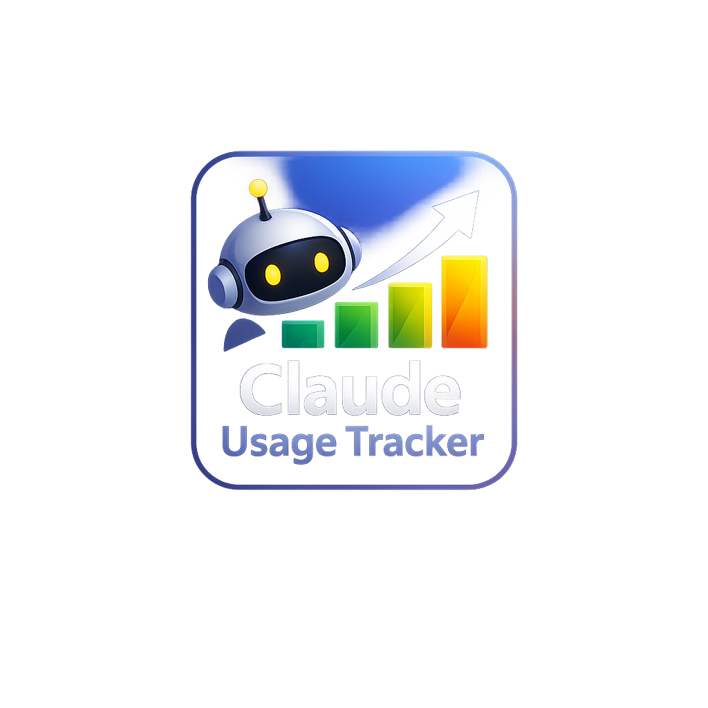

# Claude Usage Monitor

<p align="center">
  
</p>

A lightweight Windows system-tray tool that shows your [claude.ai](https://claude.ai) usage limits at a glance — without opening a browser tab.

> **Disclaimer:** This tool uses internal, undocumented claude.ai API endpoints that Anthropic has not publicly documented. It may break without notice. This project is not affiliated with or endorsed by Anthropic.

## Quick start

**Option A — Download the EXE (no Python required)**

1. Download `ClaudeUsageMonitor.exe` from the [latest release](../../releases/latest)
2. Double-click it — it starts silently in the system tray

**Option B — Build from source**

1. Install [uv](https://docs.astral.sh/uv/) if you haven't already
2. Clone the repo and run:
   ```
   build_exe.bat
   ```
   The script handles everything (dependencies, PyInstaller, build). The EXE ends up in `dist\ClaudeUsageMonitor.exe`.

## How it works

The tool reads your existing Firefox session cookies directly from Firefox's local cookie database — **no passwords, no manual exports, no stored credentials**. It then polls `claude.ai`'s internal `/usage` endpoint every 30 seconds (configurable) and updates the tray icon and floating widget accordingly. Firefox does not need to be open while the tool is running.

## Requirements

- Windows 10/11
- Firefox — must be logged in to claude.ai at least once to populate the cookie database
- Python 3.11+ and [uv](https://docs.astral.sh/uv/) *(only if building from source)*

## Tray icon

The coloured circle reflects your current **session (5-hour)** limit:

| Colour | Session usage |
|--------|--------------|
| 🟢 Green  | Below 40%   |
| 🟡 Yellow | 40–59%      |
| 🟠 Orange | 60–84%      |
| 🔴 Red    | 85%+        |
| ⚫ Grey   | No data / error |

Right-click the icon for **Show widget**, **Refresh now**, **View log file**, and **Quit**.

## Floating widget

An always-on-top mini-panel shows:

- **Session** — 5-hour usage % with progress bar
- **Weekly** — weekly usage % with progress bar
- **Reset countdown** — time until the session limit resets; the dot colour indicates how soon the limit refreshes:

  | Dot colour | Time until reset |
  |------------|-----------------|
  | 🟢 Green  | < 15 min        |
  | 🟡 Yellow | 15–30 min       |
  | 🟠 Orange | 30–90 min       |
  | 🔴 Red    | > 90 min        |

- Progress bars use the same four-colour scale as the tray icon (green → yellow → orange → red at 40 / 60 / 85 %)
- Hover to reveal **refresh (⟳)**, **minimise (−)**, and **quit (×)** buttons
- Drag anywhere to reposition; drag the bottom-right grip to resize
- Right-click for a context menu
- Position and size are remembered between sessions

**Error display** — when a poll fails, the footer shows a short inline message (e.g. *"Session expired — open claude.ai in Firefox"*). For unexpected errors it shows *"Error — hover here for details"*; hovering over that text reveals a tooltip with the full error message and the path to the log file.

Minimise via the **−** button; restore via the tray icon (left-click or **Show widget**).

## Configuration

The config file is created automatically on first run at:

```
%APPDATA%\claude-usage-monitor\config.toml
```

Available settings:

```toml
# How often to poll claude.ai (seconds). Default: 30.
poll_interval_seconds = 30

# Percent thresholds that trigger a desktop notification.
notification_thresholds = [80, 95]

# Override the Firefox profile directory.
# Leave empty for auto-detection (recommended).
firefox_profile_path = ""

# Log level: DEBUG, INFO, WARNING, ERROR
log_level = "WARNING"
```

### Custom Firefox profile

If auto-detection fails (e.g. you use a non-default profile), set the path manually:

```toml
firefox_profile_path = "C:\\Users\\YourName\\AppData\\Roaming\\Mozilla\\Firefox\\Profiles\\abc123.default-release"
```

## Running from source

If you want to run without building an EXE:

```bash
uv sync
start.bat
```

Or directly:

```bash
uv run python -m claude_usage_monitor
```

## Rebuilding the EXE

```bash
# Incremental rebuild (~10 s, uses cached build/):
build_exe.bat

# Clean rebuild from scratch (~30 s):
build_exe_clean.bat
```

## Troubleshooting

### Grey icon / "No claude.ai cookies found"

Firefox must be logged in to claude.ai. Open [claude.ai](https://claude.ai) in Firefox and log in, then wait for the next poll or right-click the tray icon → **Refresh now**.

### "Session expired" / grey icon after working for a while

Your Cloudflare clearance cookie has expired. Visit claude.ai in Firefox — browsing the page automatically refreshes the cookie. The next poll will succeed.

### "Firefox profiles.ini not found"

Firefox is either not installed or has never been launched. Install Firefox and log in to claude.ai.

### Requests return 403

Cloudflare is blocking the request. Usually the `cf_clearance` cookie is stale. Open claude.ai in Firefox, navigate around briefly, then right-click → **Refresh now**.

### The usage numbers seem wrong

The `/usage` endpoint uses Anthropic's internal bucket names (e.g. `seven_day_omelette`). The mapping to human-readable labels is best-effort and may be incorrect. Open an issue if you can confirm the correct mapping for your plan.

## Project structure

```
src/claude_usage_monitor/
├── __main__.py         Entry point
├── app.py              Orchestration (threads, callbacks)
├── config.py           TOML config, OS paths
├── firefox_cookies.py  Read cookies.sqlite from Firefox
├── client.py           httpx calls to claude.ai (⚠ reverse-engineered)
├── models.py           UsageData / LimitInfo dataclasses
├── poller.py           Background polling thread
├── tray.py             pystray icon + colour logic
├── widget.py           Persistent always-on-top tkinter widget
└── notifications.py    Desktop notification throttling
```

## Privacy

- No data leaves your machine except the HTTPS requests to `claude.ai` (which your browser already makes).
- No cookies or tokens are stored to disk by this tool; they are read fresh from Firefox before every poll.
- No telemetry.

## License

MIT
